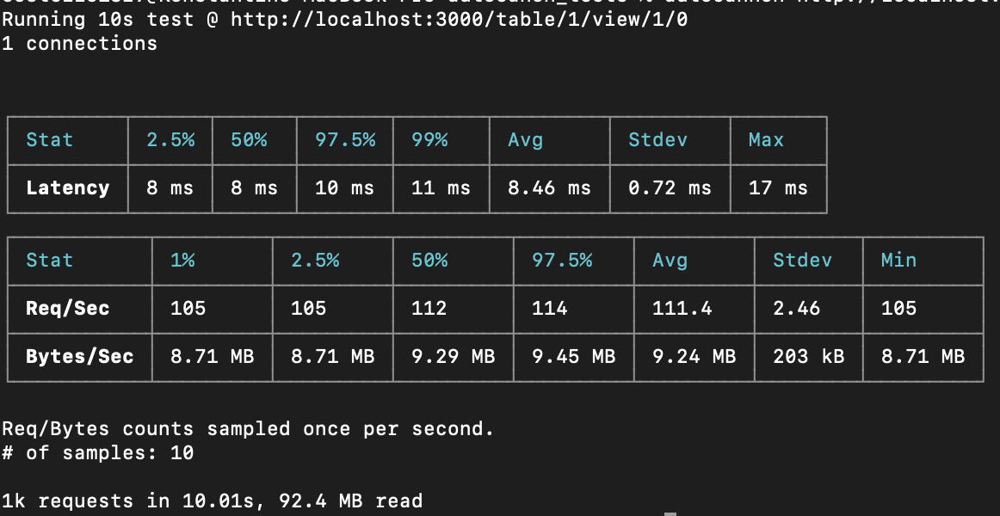
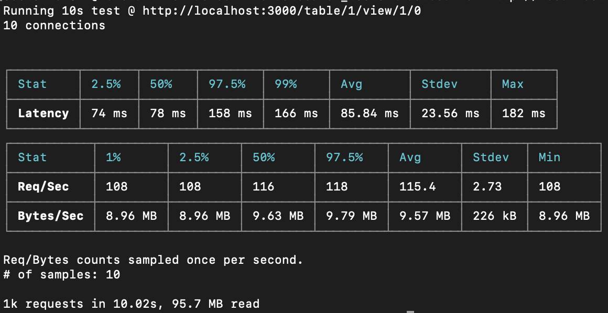
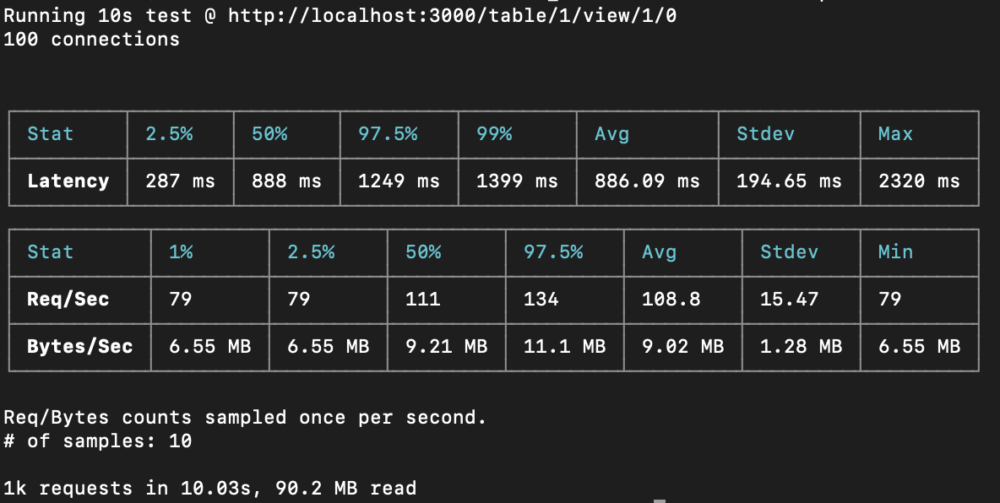

# Результаты тестирования производительности модели базы данных Violet:

## Процесс тестирования
1. Создаем таблицу из 90 строковых колонок, 10 числовых и 10000 строк, заполненных числами от 1 до 1000 и восьмибуквенными строками в столбах соответствующего типа. Среденее время создания (avg 10): 1.8s
2. Создаем view этой таблицы. Среднее время создания: `[35–40]ms`
3. Изменяем порядок индексов столбцов так, чтобы столбцы шли в обратном порядке. Среднее время (avg 10): `[0.10-0.15]s`
4. Отключаем каждый второй столбец. Среднее создания: `[20–30]ms
5. Добавляем 10 фильтров на числовые столбцы вида `col > 100` или `val < 900`
6. На получение одной страницы из 50 строк уходит от `[10 – 20]ms`, что позволит использовать этот метод для динамической отрисовки таблиц
7. При помощи autocanon протестировал работу на одном, десяти и ста одновременных клиентах (такие бизнес-требования). Тестировал эндпоинт получения страницы view. Запускал тест так: `autocannon http://localhost:3000/table/1/view/1/0 -c {n}`, где `n` было равно `1`, `10`, `100`. Скрины с результатами тестов в конце документа.

Этапы 1–6 выделил в отдельный эндпоинт `prepare_test`.

+ Один клиент: 
+ Десять клиентов: 
+ Сто клиентов: 
